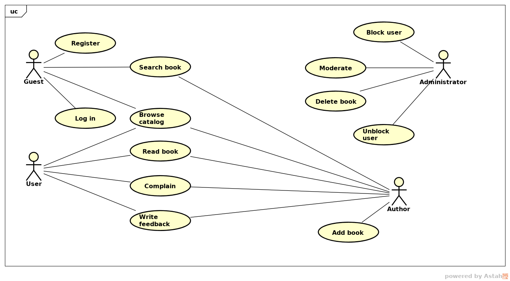

#Домашнее задание №2

##Вариант 1.d. Электронная библиотека

##Задания, текущий ход исполнения
1. [ ] Сделать UML диаграммы:
	- [x] Use case diagram
	- [ ] Sequence diagram
	
##Общие сведения
Документ описывает требования к разрабатываемой информационной системе **Электронная библиотека**.

##Основная цель системы
Цель системы предоставление в открытый доступ ресурсов. Главное требование к ресурсам - публикация с открытой лицензией (предпочтительно в [Creative Commons](http://creativecommons.ru/licenses))

##Термины и сокращения
| Наименование | Расшифровка |
| --|-- |
| Автор | Собственник сочинений |
| Администратор | Пользовтаель с повышенными привелегиями в системе |
| Читатель | Зарегистрированный в системе пользователь |
| Гость | Незарегистрированный в системе пользователь |
| БД | База данных |

##Описание сценариев использования
Сценарий использования показана на рисунке ниже:

##Функциональные требования к системе
ФТ1. Система должна позволять осуществлять следующий набор действий с книгами:
- Просмотр списка книг;
- Сортировка книг по дате, по популярности, по автору;
- Добавление новых книг;
- Удаление книг;
- Добавление рецензий/комментария;
- Чтение книги;

ФТ2. Система должна позволять осуществлять следующий набор действий с пользователями:
- Создание нового пользователя;
- Удаление пользователя;
- Блокирование пользователя;
- Разблокировка заблокированного пользователя;

##Функциональные роли системы
**Гость** - пользователь с минимальными правами. Может  просматривать список книг, пользоваться поиском а так же читать описание книги и рецензий читателей.
**Читатель** - пользователь со стандартными правами. Имеет все права гостя, плюс может читать книги, оставлять отзывы, а так же оставлять жалобу.
**Автор** - пользователь, у которого есть права как гостя, так и читателя. К тому же имеет право на добавление ресурсов, редактирование и удаление ресурсов.
**Администратор** - пользователь с особыми привелегиями. Имеет привелегию гостя и читателя. Плюс ко всему имеет право блокировать  пользователей и удалять спорный ресурс.

##Срок исполнения
ETA: ~6 недель.

##План-график реализации системы
| Наименование релиза | Срок | Состав |
| --|--|-- |
| 0.0.1 | до 21 ноября 2016 | Составление ТЗ, UML схемы |

##Общие требования к решениям:
- Стойкость к высоким нагрузкам;
- Отказоустойчивость;
- Логгирование состояний (разные уровни – как минимум дебаг, ошибки);
- Покрытие публичных методов модульными тестами;
- Javadoc’и;
- Корректное разбиение на версии и релизы;
- Наличие web-интерфейса (минимум jsp + html);
- Наличие RESTful API;

##Используемые стек технологий:
- ***Java SE 8*** - язык программирования
- ***Jetty*** - веб сервер
- ***JDBC*** 
- ***h2*** - БД
- ***slf4j (log4j)*** - библиотека логгирования
- ***nginx*** - сервер балансировки, передача статических файлов
- ***Bootstrap*** - фронтенд
- ***JUnit 4*** - фреймворк юнит тестировния
- ***Mockito*** - фреймворк mock тестирования
- ***Gradle*** - система сборки

##Допущения и ограничения
- Требования к эстетическому виду и эргономичности пользовательского интерфейса не выдвигаются

##Вопросы к консультанту
1. По техническим причинам не смог установить PostgreSQL. MySQL использовать не хочется по этому выбрал БД  h2. Могу ли я вместо  реляционных БД использовать NoSQL, в частности MongoDB?

